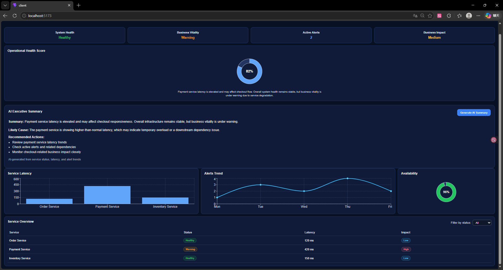

# Service Sentinel Prototype

## Overview
This project is a simplified full-stack dashboard prototype inspired by the idea of a "Service Sentinel" platform.

The goal of this project is to explore how raw technical monitoring data can be transformed into clear, actionable, and business-oriented insights for decision-makers.

Rather than focusing on production-level integration, this prototype focuses on product logic, dashboard design, and data interpretation.

## Screenshot



---

## Why I Built This Project
I built this project to better understand the responsibilities of a Fullstack Developer working on monitoring and observability platforms.

In particular, I wanted to explore:

- How to structure a dashboard for both technical and business users
- How to transform technical signals (latency, alerts) into business impact
- How an AI layer could help summarize system state
- How frontend and backend interact in a full-stack monitoring system

---

## Tech Stack
- **Frontend:** React, TypeScript, Vite
- **Backend:** Node.js, Express
- **Database:** PostgreSQL
- **Styling:** CSS
- **AI Summary:** Simulated with rule-based backend logic

---

## Key Features

### Dashboard Overview
- High-level indicators:
  - System Health
  - Business Vitality
  - Active Alerts
  - Business Impact

### Operational Health Score
- Aggregates multiple signals into a single percentage

### AI Executive Summary (Simulated)
- Generates:
  - Summary
  - Likely cause
  - Recommended actions
- Based on rule-based backend logic (not a real LLM)

### Technical Metrics
- Service latency visualization
- Alert trends
- Availability indicators

### Service Overview
- List of services with status
- Filtering to identify problematic services

---

## What is Mocked vs Real

### Mocked
- Monitoring data (latency, alerts, services)
- AI summary logic (rule-based simulation)

### Real
- Frontend-backend architecture
- API design and data flow
- Dashboard structure and interaction logic

This project is a functional prototype, not a production-ready monitoring system.

---

## Architecture

### Backend Structure
- `routes/` – API endpoints
- `controllers/` – request handling and response formatting
- `models/` – data access logic

### Data Flow
1. Frontend sends an API request
2. Backend controller retrieves data from models
3. Data is structured into a JSON response
4. Frontend renders the dashboard UI

### AI Summary Flow
1. Frontend sends current dashboard data
2. Backend applies rule-based logic
3. Backend returns summary, likely cause, and recommendations

---

## How to Run

### Backend
```bash
cd server
npm install
node index.js
```

### Frontend
```bash
cd client
npm install
npm run dev
```